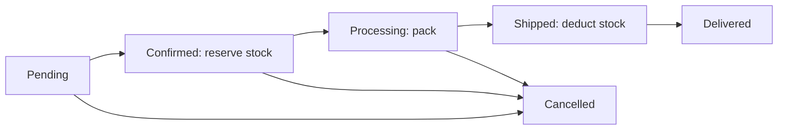
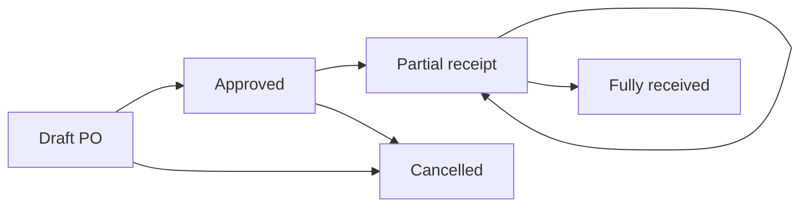
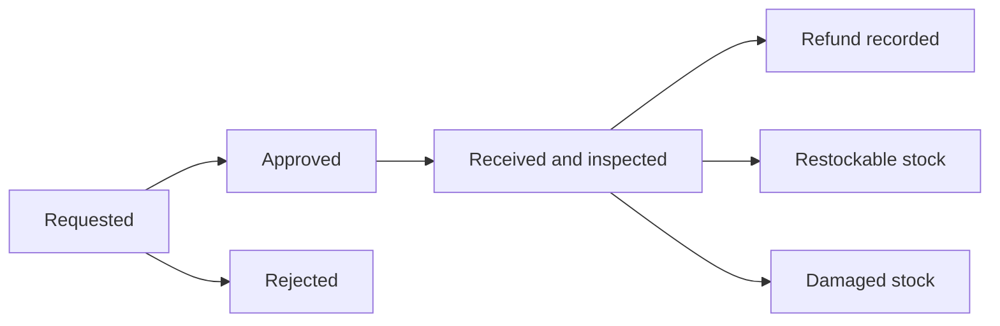

# Business Workflows

## Customer order

```mermaid
flowchart LR
    A[Pending] --> B[Confirmed: reserve stock]
    B --> C[Processing: pack]
    C --> D[Shipped: deduct stock]
    D --> E[Delivered]
    A --> X[Cancelled]
    B --> X
    C --> X
```

## Purchasing

```mermaid
flowchart LR
    A[Draft PO] --> B[Approved]
    B --> C[Partial receipt]
    C --> C
    C --> D[Fully received]
    A --> X[Cancelled]
    B --> X
```

## Return and refund

```mermaid
flowchart LR
    A[Requested] --> B[Approved]
    A --> X[Rejected]
    B --> C[Received and inspected]
    C --> D[Refund recorded]
    C --> E[Restockable stock]
    C --> F[Damaged stock]
```
